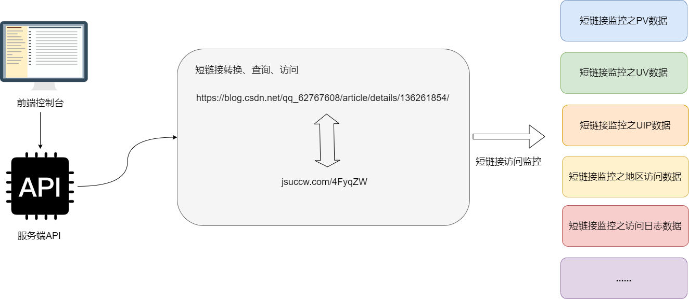
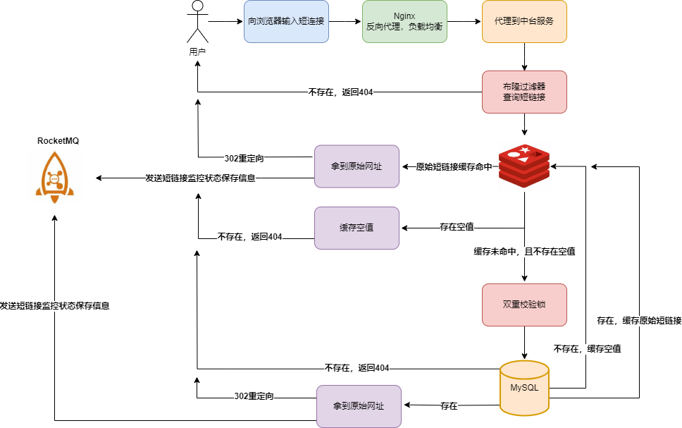

# 简介

短链接系统是一种用于将长URL（Uniform Resource Locator）转换为较短、易于分享和记忆的URL的工具或服务。常被用于在互联网上分享链接，尤其是在社交媒体平台、微博、**短信等限制字符数量的场景**下。

短链接系统的基本原理是将长URL通过**哈希算法**映射到一个较短的唯一标识符或代码。当用户访问短链接时，系统会将短链接映射回原始的长URL，然后将用户重定向到原始的目标网址。

除了单纯的跳转之外，短链接系统**最核心的**还是在于它的**监控价值**。**本平台提供了深入的分析和跟踪功能，用户可以灵活地管理和优化其链接，从而实现更好的营销效果和业务成果。**

# 短链接跳转设计

